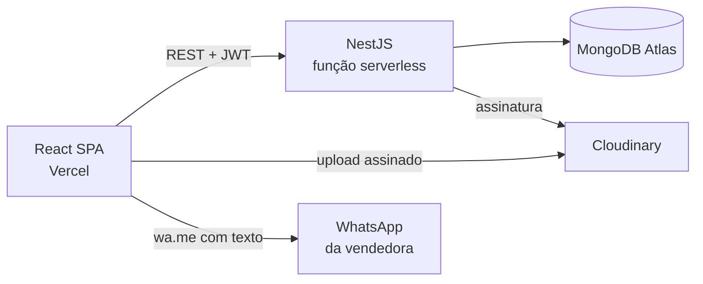

# Maison Essence — Plano de prompts (backend → frontend)

2026-09-20 · @Someone

## Decisões fechadas

O sistema é uma loja única da Maison Essence: catálogo próprio, checkout calculado no servidor e finalização por WhatsApp. Nenhum pagamento é processado no site.

| Decisão | Escolha | Impacto no código |
| --- | --- | --- |
| Finalização do pedido | Mensagem formatada no WhatsApp, sem gateway | Sem webhook, sem PCI; servidor só calcula e formata |
| Contas de cliente | Convidado por padrão, conta opcional | Dois caminhos de checkout; schema `Customer` separado de `User` |
| Papéis | `SUPER_ADMIN` (você), `OWNER` (a dona), `STAFF` | Enum de papel + guard por rota |
| Criação de usuários | Painel de super-admin | Módulo `users` com CRUD restrito a `SUPER_ADMIN` |
| Entrega | Taxa fixa por cidade + retirada na loja | Coleção `DeliveryCity`; nenhuma API de frete |
| Produtos | Variantes com preço e estoque próprios | `Product` com array de variantes; estoque por variante |
| Imagens | Cloudinary com assinatura no backend | Rota de assinatura; upload direto do navegador |
| Hospedagem | Vercel, dois projetos separados | NestJS atrás de handler serverless; conexão Mongo cacheada |

O catálogo segue a referência Importss JS: categorias por tipo e por gênero, badge de esgotado, preço riscado com percentual de desconto, parcelamento exibido no card e desconto progressivo por quantidade.

## Arquitetura na Vercel

Dois projetos Vercel independentes, dois repositórios (ou um monorepo com duas raízes). O frontend nunca fala com o Mongo; o backend nunca serve HTML.



O NestJS roda como **uma única função serverless**. Isso muda três coisas em relação a um servidor Node comum.

- A instância do Nest é criada uma vez e guardada em variável de módulo. Recriar a cada request custa 2–4 s de cold start.
- A conexão do Mongoose também é cacheada em `global`, com `bufferCommands: false` e `maxPoolSize: 10`. Sem isso, cada invocação abre uma conexão nova e o Atlas derruba por limite.
- Nada de `@nestjs/schedule`, filas em memória, WebSocket ou escrita em disco. Se precisar de tarefa agendada, use Vercel Cron chamando uma rota protegida por segredo.

### Variáveis de ambiente

| Variável | Projeto | Para quê |
| --- | --- | --- |
| `MONGODB_URI` | backend | String do Atlas com nome do banco |
| `JWT_ACCESS_SECRET` | backend | Assina o access token (15 min) |
| `JWT_REFRESH_SECRET` | backend | Assina o refresh token (7 dias) |
| `CLOUDINARY_CLOUD_NAME` | backend | Conta Cloudinary |
| `CLOUDINARY_API_KEY` | backend | Assinatura de upload |
| `CLOUDINARY_API_SECRET` | backend | Assinatura de upload, nunca no front |
| `CORS_ORIGINS` | backend | Lista separada por vírgula dos domínios do front |
| `BOOTSTRAP_SUPERADMIN_EMAIL` | backend | Cria o primeiro super-admin no primeiro boot |
| `BOOTSTRAP_SUPERADMIN_PASSWORD` | backend | Idem, removida depois do primeiro uso |
| `VITE_API_URL` | frontend | URL do backend |
| `VITE_CLOUDINARY_CLOUD_NAME` | frontend | Monta URL de imagem otimizada |

## Design system extraído do mockup

A identidade é preto profundo, creme e dourado, com serifada de alto contraste nos títulos e sans-serif no corpo. Esses tokens entram inteiros no prompt 20 e não devem ser reinventados por prompt nenhum.

| Token | Valor | Uso |
| --- | --- | --- |
| `--ink` | `#0E0E0E` | Header, bloco da marca, botões primários, texto forte |
| `--ink-soft` | `#3A3A3A` | Texto de corpo |
| `--muted` | `#8A8578` | Texto secundário, labels, placeholders |
| `--cream` | `#FAF7F2` | Fundo geral da loja |
| `--sand` | `#F1E9DD` | Fundo de seções alternadas e chips |
| `--surface` | `#FFFFFF` | Cards, inputs, painéis |
| `--gold` | `#C0A062` | Filete do logo, ícones, detalhes, hover |
| `--gold-deep` | `#9C7C3C` | Texto dourado sobre creme, estados ativos |
| `--line` | `#E3DACD` | Bordas de 1px |
| `--success` | `#2E7D5B` | Selo de pronta entrega, confirmação |
| `--danger` | `#B3261E` | Esgotado, erros |

Cores utilitárias para o painel administrativo: fundo `#F6F5FB`, sidebar `--ink`, item ativo com fundo `rgba(192,160,98,.14)` e borda esquerda dourada de 3px.

### Tipografia

- Títulos, logo e nomes de produto: **Cormorant Garamond**, pesos 400/600. O logotipo usa caixa alta com `letter-spacing: .28em`.
- Corpo, botões, preços e painel: **Jost** (ou Inter), pesos 400/500/600.
- Escala: 48/36/28/22/18/16/14/12 px, com `line-height` 1.15 nos títulos e 1.6 no corpo.
- Preço sempre em Jost 600 e tabular (`font-variant-numeric: tabular-nums`), para os valores não dançarem no grid.

### Forma e espaçamento

- Raio: 4px em chips e inputs, 12px em cards, 16px em modais e blocos de checkout.
- Escala de espaço: 4, 8, 12, 16, 24, 32, 48, 64, 96 px.
- Sombra única e discreta: `0 1px 2px rgba(14,14,14,.04), 0 8px 24px rgba(14,14,14,.06)`. Nada de sombra colorida.
- Container 1280px com gutter de 24px no desktop e 16px no mobile. Grid de produtos: 4 colunas ≥1200px, 3 até 1024px, 2 no mobile.
- Transições de 180ms `ease-out`. Card sobe 2px no hover e a imagem faz zoom de 1.03.

### Componentes-chave

| Componente | Anatomia |
| --- | --- |
| Header | Barra de avisos preta rolando, logo centralizado, menu, busca, carrinho com contador |
| Card de produto | Imagem 3:4, selos no canto, categoria, nome, preço riscado + preço, parcelamento, botão |
| Selos | `Esgotado` em `--danger`, `-33%` em `--ink`, `Pronta entrega` em `--success`, todos 12px caixa alta |
| Botão primário | Fundo `--ink`, texto creme, 48px de altura, caixa alta, `letter-spacing: .08em` |
| Botão secundário | Contorno 1px `--ink`, fundo transparente |
| Chip de categoria | Pílula, borda `--line`; ativo com fundo `--ink` e texto creme |
| Passo do checkout | Card branco, título 18px, campos empilhados, botão largo embaixo |
| Flutuante do WhatsApp | Círculo 56px, verde `#25D366`, canto inferior direito, acima do rodapé |

## Modelo de dados

Onze coleções. Todo valor monetário é armazenado em centavos, como inteiro, nunca em ponto flutuante, para não acumular erro de arredondamento no parcelamento.

| Coleção | Campos principais | Observação |
| --- | --- | --- |
| `User` | `name`, `email`, `passwordHash`, `role`, `isActive`, `mustChangePassword`, `lastLoginAt` | Papéis: SUPER\_ADMIN, OWNER, STAFF |
| `RefreshToken` | `userId`, `tokenHash`, `expiresAt`, `revokedAt`, `replacedBy`, `userAgent` | Rotação com detecção de reuso |
| `Category` | `name`, `slug`, `parentId`, `image`, `order`, `isActive` | Um nível de subcategoria, como na referência |
| `Product` | `name`, `slug`, `description`, `brand`, `categoryIds`, `images`, `variants`, `isActive`, `isFeatured`, `isReadyToShip`, `tags` | Variantes embutidas, não coleção separada |
| `Product.variants` | `sku`, `label`, `priceCents`, `compareAtPriceCents`, `stock`, `image`, `isActive` | O label é 100ml ou Asad Elixir |
| `QuantityDiscount` | `productId` ou `categoryId`, `minQty`, `percentOff` | Reproduz o desconto por quantidade da referência |
| `DeliveryCity` | `name`, `state`, `feeCents`, `estimatedDays`, `isActive`, `order` | Cidades atendidas com taxa fixa |
| `StoreSettings` | `whatsappNumber`, `storeName`, `pickupAddress`, `banners`, `announcementText`, `socialLinks`, `institutionalPages` | Documento único, sempre findOne |
| `PaymentSettings` | `acceptsPix`, `acceptsCard`, `pixKey`, `maxInstallments`, `interestFreeUpTo`, `monthlyInterestPercent`, `minInstallmentCents` | Alimenta o cálculo de parcelas |
| `Order` | `code`, `items`, `customer`, `fulfillment`, `payment`, `totals`, `status`, `whatsappMessage`, `createdAt` | Snapshot imutável de preços no momento da compra |
| `Customer` | `name`, `phone`, `email`, `passwordHash`, `addresses` | Só existe se o cliente optar por criar conta |

Duas regras que evitam retrabalho depois.

- `Order.items` guarda cópia de nome, label da variante, preço unitário e desconto aplicado. Se a dona mudar o preço amanhã, o pedido de ontem continua correto.
- `Order.status` percorre PENDING\_CONTACT, CONFIRMED, PREPARING, SHIPPED, DELIVERED e CANCELLED. Como não há gateway, quem move o status é a dona no painel.

Índices obrigatórios: slug único em `Product` e `Category`, `code` único em `Order`, índice de texto em nome e marca do produto, e índice composto por `isActive`, `categoryIds` e `createdAt`.

## Como usar estes prompts

São 32 prompts em 11 fases. Cada um é autocontido: cole o texto do bloco na sua ferramenta de código e execute. A ordem importa, porque cada prompt assume que o anterior já está funcionando.

- **Não avance sem validar.** Cada prompt termina com critérios de aceite. Se um deles falha, corrija antes de colar o próximo.
- **Cole junto o contexto fixo.** Nos prompts de backend, anexe a seção Modelo de dados. Nos de frontend, anexe a seção Design system. A ferramenta não tem memória do que você conversou aqui.
- **Um commit por prompt.** Facilita voltar atrás quando um prompt gera algo pior do que o anterior.
- **Backend primeiro, inteiro.** Só comece o prompt 19 quando o backend estiver publicado e os endpoints respondendo. O frontend consome API real, não mock.
- Onde o prompt diz para não implementar algo, é proposital: evita que a ferramenta invente pagamento online, cálculo de frete por CEP ou multi-loja.

## Fase 1 — Fundação do backend

### Prompt 1 — Scaffold do NestJS para serverless

```markdown
Crie um projeto NestJS chamado maison-essence-api, em TypeScript estrito, preparado para rodar como função serverless na Vercel.

Estrutura de pastas:
- src/main.ts (bootstrap local, para desenvolvimento em localhost:3333)
- src/app.module.ts
- src/common/ (filters, interceptors, decorators, pipes, guards compartilhados)
- src/config/ (configuração tipada e validação de variáveis de ambiente)
- src/modules/ (um diretório por domínio, ainda vazio)
- api/index.ts (handler serverless da Vercel)

Requisitos:
1. Instale e configure: @nestjs/config, class-validator, class-transformer, helmet, compression.
2. Validação global com ValidationPipe usando whitelist true, forbidNonWhitelisted true e transform true.
3. Filtro global de exceções que devolve sempre o formato { statusCode, message, error, timestamp, path }. Nunca vaze stack trace em produção.
4. Interceptor global que converte ObjectId para string e remove os campos __v e passwordHash de toda resposta.
5. Prefixo global de rotas igual a /api/v1.
6. Validação de variáveis de ambiente com Zod no boot. Se faltar variável obrigatória, a aplicação falha imediatamente com mensagem clara.
7. CORS lendo a variável CORS_ORIGINS (lista separada por vírgula), com credentials true.
8. Em api/index.ts, crie a aplicação Nest uma única vez e guarde a instância em variável de módulo, reaproveitando entre invocações. Use o adaptador Express e exporte o handler.
9. Crie vercel.json com rewrite de todas as rotas para /api/index e runtime Node.js 20.
10. Health check público em GET /api/v1/health devolvendo status, uptime e versão.

Não implemente: banco de dados, autenticação, nenhum módulo de domínio. Só a casca.

Critérios de aceite:
- npm run start:dev sobe e /api/v1/health responde 200.
- vercel dev serve a mesma rota pelo handler serverless.
- Remover uma variável obrigatória do .env derruba o boot com erro legível.
```

### Prompt 2 — Conexão com MongoDB Atlas resistente a cold start

```markdown
Adicione Mongoose ao projeto, com conexão adequada a ambiente serverless.

1. Instale @nestjs/mongoose e mongoose.
2. Crie src/database/database.module.ts usando MongooseModule.forRootAsync com ConfigService.
3. Opções de conexão: bufferCommands false, maxPoolSize 10, minPoolSize 0, serverSelectionTimeoutMS 5000, socketTimeoutMS 45000, e autoIndex ativo apenas quando NODE_ENV for development.
4. Cache de conexão: guarde a promise da conexão em globalThis, para que invocações subsequentes da mesma instância serverless reutilizem o socket em vez de abrir conexão nova.
5. Crie uma classe base abstrata de schema com timestamps true, versionKey false e toJSON transform que renomeia _id para id e remove campos internos.
6. Adicione ao health check uma verificação do readyState do Mongoose, devolvendo 503 se estiver desconectado.
7. Documente no README como criar o cluster no Atlas, criar o usuário do banco e liberar o acesso de rede para 0.0.0.0/0, exigido porque a Vercel não tem IP fixo.

Não crie nenhum schema de domínio ainda.

Critérios de aceite:
- O health check mostra a conexão como connected.
- Duas chamadas seguidas ao endpoint não abrem duas conexões. Verifique com um log no evento connected, que deve aparecer uma vez só.
```

### Prompt 3 — Schemas do domínio

```markdown
Crie todos os schemas Mongoose do projeto, sem controllers e sem services ainda. Use o modelo de dados anexo como especificação.

Regras obrigatórias:
1. Todo valor monetário é um campo inteiro em centavos, com sufixo Cents no nome. Nunca use número decimal para dinheiro.
2. Todo campo de texto exibível tem trim e tamanho máximo definido.
3. Slugs são gerados a partir do nome, únicos, com índice único, e não mudam quando o nome muda depois da criação.
4. Product tem variants como array de subdocumentos, cada um com id próprio, sku único dentro do produto, priceCents, compareAtPriceCents opcional e stock inteiro com mínimo 0.
5. Order.items é snapshot: guarda productId, variantId, nome do produto, label da variante, imagem, unitPriceCents, quantity, discountPercent e lineTotalCents. Esses campos nunca são populados por referência na leitura.
6. StoreSettings e PaymentSettings são documentos únicos. Crie um método estático getOrCreate que devolve o documento existente ou cria com os padrões.
7. Order.code segue o formato ME-AAMMDD-XXXX, com XXXX aleatório em base36 maiúscula e índice único.
8. Crie todos os índices citados no modelo de dados, incluindo o índice de texto em nome e marca do produto, com peso maior para o nome.
9. Gere os enums como objetos const de TypeScript, não como enum nativo, e exporte os tipos derivados.

Entregue também um arquivo que exporte todos os schemas e tipos a partir de um único ponto.

Não implemente CRUD, rotas nem lógica de negócio.

Critérios de aceite:
- O projeto compila em modo strict e sem any.
- Um script de teste insere e lê um documento de cada coleção.
- Tentar salvar preço como 199.90 é rejeitado ou convertido explicitamente para centavos.
```

## Fase 2 — Autenticação e usuários

### Prompt 4 — Autenticação JWT com access e refresh

```markdown
Implemente o módulo de autenticação do painel administrativo.

1. Instale @nestjs/jwt, @nestjs/passport, passport-jwt e argon2.
2. Senhas são hasheadas com argon2id. Nunca bcrypt, nunca sha.
3. Access token com validade de 15 minutos, assinado com JWT_ACCESS_SECRET, payload contendo sub, email, role e uma claim de versão de credencial.
4. Refresh token com validade de 7 dias, assinado com JWT_REFRESH_SECRET, persistido na coleção RefreshToken apenas como hash (argon2 ou sha256). Nunca guarde o token em texto puro.
5. Rotação de refresh: cada uso invalida o token atual e emite um novo, gravando replacedBy. Se um token já revogado for usado de novo, revogue toda a árvore de sessões daquele usuário e devolva 401. Isso é detecção de reuso.
6. Os tokens trafegam em cookies httpOnly, secure, sameSite none e path restrito, porque o frontend fica em domínio diferente do backend. Exponha também o access token no corpo da resposta para permitir uso em cliente que não aceita cookie cross-site.
7. Rotas: POST /auth/login, POST /auth/refresh, POST /auth/logout, POST /auth/logout-all, GET /auth/me.
8. Rate limit específico no login: 5 tentativas por 15 minutos por IP mais e-mail combinados, com resposta 429 genérica.
9. Resposta de login inválido é sempre idêntica, com tempo de resposta constante, sem revelar se o e-mail existe.
10. Usuário com isActive false não faz login. Usuário com mustChangePassword true recebe login válido mas o access token carrega a flag, e toda rota administrativa exceto a de troca de senha responde 403.

Critérios de aceite:
- Login devolve access e refresh, e /auth/me responde com o usuário.
- Usar um refresh token duas vezes invalida todas as sessões do usuário.
- Access token expirado responde 401 e o refresh renova sem novo login.
```

### Prompt 5 — Papéis, guards e módulo de usuários

```markdown
Implemente o controle de acesso por papel e o CRUD de usuários administrativos.

Papéis e permissões:
- SUPER_ADMIN: cria, edita, desativa e reseta senha de qualquer usuário. Acesso a tudo. É o papel do desenvolvedor.
- OWNER: acesso total à loja (produtos, categorias, pedidos, entrega, pagamento, configurações). Pode criar e desativar apenas usuários STAFF. Não enxerga nem edita SUPER_ADMIN.
- STAFF: lê e atualiza status de pedidos, lê catálogo. Não altera preço, não altera configurações, não gerencia usuários.

1. Crie um decorator Roles e um RolesGuard global, com um decorator Public para rotas abertas.
2. Toda rota administrativa é protegida por padrão. Rota pública precisa ser marcada explicitamente. O padrão inseguro é o erro mais comum aqui, então inverta o padrão.
3. Rotas: GET /users, POST /users, PATCH /users/:id, PATCH /users/:id/status, POST /users/:id/reset-password, PATCH /auth/change-password.
4. Ao criar um usuário, o SUPER_ADMIN define uma senha temporária e o registro nasce com mustChangePassword true.
5. Reset de senha gera nova senha temporária, marca mustChangePassword true e revoga todos os refresh tokens daquele usuário.
6. Desativar usuário revoga todas as suas sessões imediatamente.
7. Ninguém pode desativar a si mesmo, e o sistema impede que o último SUPER_ADMIN ativo seja desativado.
8. Toda ação sobre usuário grava log estruturado com ator, alvo, ação e data.

Critérios de aceite:
- OWNER recebe 403 ao tentar criar um SUPER_ADMIN.
- STAFF recebe 403 ao tentar alterar preço de produto.
- Desativar um usuário logado derruba a sessão dele na próxima chamada.
```

### Prompt 6 — Bootstrap do primeiro super-admin

```markdown
Crie o mecanismo de criação do primeiro usuário, já que não existe ninguém no banco para criar o primeiro.

1. Comando de seed executável por npm run seed:superadmin, que lê BOOTSTRAP_SUPERADMIN_EMAIL e BOOTSTRAP_SUPERADMIN_PASSWORD e cria o usuário com papel SUPER_ADMIN e mustChangePassword true.
2. O comando é idempotente: se já existir um SUPER_ADMIN, ele não cria outro e avisa.
3. Como a Vercel não dá shell, crie também uma rota POST /auth/bootstrap protegida por um header com o segredo BOOTSTRAP_SECRET, que faz a mesma coisa e se recusa a funcionar se já houver qualquer usuário no banco.
4. Documente no README que BOOTSTRAP_SECRET deve ser removido das variáveis de ambiente depois do primeiro uso.
5. Crie também um seed de dados de demonstração (npm run seed:demo) com 3 categorias, 6 produtos com variantes, 2 cidades de entrega e as configurações padrão da loja, para poder testar o frontend depois sem cadastrar tudo à mão.

Critérios de aceite:
- Rodar o seed duas vezes não cria dois super-admins.
- Com um usuário já existente, POST /auth/bootstrap responde 409.
- O seed de demonstração popula a loja e o catálogo público já retorna produtos.
```

## Fase 3 — Catálogo

### Prompt 7 — Categorias

```markdown
Implemente o módulo de categorias.

1. Rotas administrativas: GET /admin/categories, POST, PATCH /:id, DELETE /:id, PATCH /reorder.
2. Rotas públicas: GET /categories (árvore completa, só ativas) e GET /categories/:slug.
3. Suporte a um nível de subcategoria, via parentId. Uma subcategoria não pode ter filhos.
4. Slug gerado automaticamente do nome, único, editável manualmente. Ao editar o slug, registre o antigo em previousSlugs e responda com redirect 301 semântico no público, para não quebrar link já compartilhado no WhatsApp.
5. Campo order inteiro controla a posição no menu. A rota de reorder recebe uma lista de ids na ordem desejada e persiste em uma única operação em lote.
6. Não é possível excluir categoria que tenha produtos ativos ou subcategorias. A resposta 409 informa quantos produtos estão vinculados e oferece a opção de desativar em vez de excluir.
7. A resposta pública de categoria traz productCount calculado, para o menu exibir a contagem.

Critérios de aceite:
- A árvore pública devolve pais com seus filhos aninhados, ordenados por order.
- Excluir categoria com produto responde 409 com a contagem.
```

### Prompt 8 — Produtos com variantes

```markdown
Implemente o módulo de produtos, que é o núcleo do sistema.

1. Rotas administrativas: GET /admin/products (com busca, filtro por categoria e status, paginação), GET /admin/products/:id, POST, PATCH /:id, DELETE /:id, PATCH /:id/status (toggle rápido, igual ao do painel no mockup).
2. Gestão de variantes na mesma rota do produto: o PATCH recebe o array completo de variantes e faz o diff. Variante removida que já aparece em algum pedido é apenas desativada, nunca apagada.
3. Cada variante tem sku, label, priceCents, compareAtPriceCents, stock, image e isActive. O sku é único dentro do produto e gerado automaticamente se não informado.
4. Produto sem variante não existe. Produto simples é um produto com exatamente uma variante de label vazio, e a API esconde essa complexidade devolvendo um campo hasVariants booleano.
5. Campos de vitrine: isFeatured (destaques da home), isReadyToShip (seção pronta entrega), isActive.
6. O produto expõe campos calculados na leitura: priceRangeCents com mínimo e máximo das variantes ativas, discountPercent do maior desconto disponível, inStock booleano e totalStock somado.
7. Ordenação de imagens por índice, com a primeira sendo a capa. A imagem da variante, quando existe, substitui a capa ao ser selecionada.
8. Validação: compareAtPriceCents, quando presente, precisa ser maior que priceCents. Caso contrário devolva 422 com mensagem em português.
9. Controle de estoque: campo allowBackorder por variante. Com false, a variante fica indisponível em stock 0 e o card mostra esgotado.

Critérios de aceite:
- Criar produto com 3 variantes de preços diferentes devolve priceRangeCents correto.
- Zerar o estoque de todas as variantes faz inStock virar false.
- Remover uma variante usada em pedido a desativa em vez de apagar.
```

### Prompt 9 — Upload de imagens via Cloudinary

```markdown
Implemente o upload de imagens do painel, usando upload assinado direto para o Cloudinary.

1. O arquivo nunca passa pelo backend. A função serverless da Vercel tem limite de payload e timeout, então o navegador envia direto para o Cloudinary.
2. Rota POST /admin/uploads/signature, restrita a OWNER e SUPER_ADMIN, que devolve timestamp, signature, apiKey, cloudName e folder. A assinatura inclui a pasta de destino e restrições, e vale 1 hora.
3. Pastas: maison-essence/products, maison-essence/categories, maison-essence/banners.
4. Restrições assinadas: tipos jpg, png e webp; máximo 5 MB; transformação de entrada limitando o maior lado a 2000px.
5. Rota POST /admin/uploads/confirm que recebe publicId e metadados devolvidos pelo Cloudinary, valida que o publicId pertence a uma das pastas permitidas e só então permite vinculá-lo a um produto. Sem essa validação, qualquer URL pode ser injetada.
6. Rota DELETE /admin/uploads/:publicId que remove do Cloudinary, usada quando a dona troca a foto. Antes de remover, verifique se nenhum produto ainda referencia aquele publicId.
7. Crie um helper compartilhado que monta a URL de entrega com transformações: f_auto, q_auto, e width conforme o contexto (thumb 400, card 600, detalhe 1200). O frontend usará esse mesmo helper.
8. Guarde no banco o publicId e não a URL completa, para poder trocar de conta ou de transformação depois sem migrar dados.

Critérios de aceite:
- O painel consegue subir uma foto sem o arquivo tocar o backend.
- Um publicId de pasta não permitida é rejeitado no confirm.
- A URL gerada para o card entrega webp quando o navegador suporta.
```

### Prompt 10 — Catálogo público, busca e filtros

```markdown
Implemente as rotas públicas de catálogo, otimizadas para leitura.

1. GET /products com query params: category (slug), q (busca), brand, minPrice, maxPrice, inStock, readyToShip, featured, sort e page.
2. Ordenações: relevance (padrão quando há busca), newest, price_asc, price_desc, discount, name.
3. Paginação por página com limite padrão de 24 e teto de 48, devolvendo items, page, totalPages, totalItems e hasMore.
4. Busca usa o índice de texto em nome e marca, com fallback para regex case-insensitive quando o termo tem menos de 3 caracteres.
5. GET /products/:slug devolve o produto completo com variantes ativas, categorias e até 8 produtos relacionados da mesma categoria.
6. GET /products/featured, GET /products/ready-to-ship e GET /products/best-sellers, esta última ordenada por quantidade vendida agregada dos pedidos confirmados.
7. Toda rota pública devolve apenas produtos e variantes com isActive true, e nunca expõe custo, sku interno ou campos administrativos.
8. Adicione cabeçalho Cache-Control com s-maxage de 60 segundos e stale-while-revalidate de 300 nas rotas públicas, para a CDN da Vercel absorver o tráfego.
9. Aplique os descontos por quantidade configurados, devolvendo em cada produto a regra aplicável, para o card exibir a chamada de desconto progressivo.

Não implemente carrinho nem pedido ainda.

Critérios de aceite:
- Buscar por uma marca devolve resultados ordenados por relevância.
- Filtro combinado de categoria mais faixa de preço mais inStock funciona em uma única query.
- Produto inativo não aparece em nenhuma rota pública, nem por slug direto.
```

## Fase 4 — Configurações da loja

### Prompt 11 — Configurações gerais

```markdown
Implemente o módulo de configurações da loja, que é o que torna o sistema operável sem programador.

1. StoreSettings é documento único. Rotas: GET /admin/settings, PATCH /admin/settings e GET /settings (pública, com subconjunto seguro dos campos).
2. Campos editáveis: storeName, whatsappNumber, announcementText (a barra rolante do topo), pickupAddress completo, horário de funcionamento, socialLinks (instagram, tiktok), e-mail de contato.
3. whatsappNumber é validado e normalizado para o formato internacional só com dígitos (exemplo 5588999999999). Rejeite qualquer outro formato com mensagem explicando o esperado.
4. Banners da home: array com imagem desktop, imagem mobile, título, subtítulo, texto do botão, link, ordem e período de exibição opcional com data de início e fim. A rota pública devolve só os banners vigentes.
5. Páginas institucionais editáveis: Quem Somos, Trocas e Devoluções, Perguntas Frequentes, Como Comprar, Política de Privacidade. Cada uma com título, slug fixo, conteúdo em markdown e isActive. Rotas públicas GET /pages e GET /pages/:slug.
6. Toda alteração em configurações grava um registro de auditoria com o usuário e o diff dos campos alterados.
7. A rota pública de settings tem cache de 300 segundos na CDN, e o PATCH administrativo invalida esse cache via revalidação por tag ou por bump de versão no ETag.

Critérios de aceite:
- Trocar o número do WhatsApp no painel muda o destino da mensagem de pedido sem redeploy.
- Um banner com data de fim no passado não aparece na rota pública.
```

### Prompt 12 — Cidades e taxas de entrega

```markdown
Implemente o módulo de entrega. Não há integração com Correios nem cálculo por CEP.

1. Rotas administrativas: GET /admin/delivery-cities, POST, PATCH /:id, DELETE /:id, PATCH /reorder.
2. Cada cidade tem name, state (sigla), feeCents, estimatedDays, minOrderForFreeCents (opcional, para frete grátis acima de um valor), isActive e order.
3. Rota pública GET /delivery-cities devolvendo só as ativas, ordenadas, com a taxa formatada.
4. Configuração de retirada na loja: flag pickupEnabled, endereço e instruções, vindos de StoreSettings.
5. Regra de frete grátis global opcional em StoreSettings, com valor mínimo. A regra da cidade tem precedência sobre a global.
6. Crie um serviço DeliveryService com o método resolveFee, que recebe cityId, modo (delivery ou pickup) e subtotal, e devolve feeCents, isFree e o motivo textual da isenção quando houver. Esse serviço é a única fonte de verdade da taxa, e será chamado pelo cálculo de pedido. Nunca calcule frete em outro lugar.
7. Cidade desativada que ainda aparece em pedidos antigos continua legível, porque o pedido guarda snapshot do nome e da taxa.

Critérios de aceite:
- Um pedido acima do mínimo em cidade com frete grátis devolve feeCents 0 e o motivo preenchido.
- Escolher retirada zera a taxa e dispensa endereço.
```

### Prompt 13 — Regras de pagamento e parcelamento

```markdown
Implemente o módulo de configuração de pagamento. Lembre-se: nenhum pagamento é processado, apenas informado.

1. PaymentSettings é documento único, com acceptsPix, pixKey, pixDiscountPercent, acceptsCard, maxInstallments, interestFreeUpTo, monthlyInterestPercent e minInstallmentCents.
2. Rotas: GET /admin/payment-settings, PATCH /admin/payment-settings e GET /payment-settings (pública, sem expor a chave PIX completa, apenas o tipo).
3. Crie um serviço InstallmentService com o método buildOptions, que recebe um total em centavos e devolve a lista de parcelas possíveis. Cada item traz number, installmentCents, totalCents e hasInterest.
4. Regra: até interestFreeUpTo, divide o total sem juros. Acima disso, aplica juros compostos mensais pela fórmula de price. Nenhuma parcela pode ficar abaixo de minInstallmentCents, e as opções que violarem isso são omitidas.
5. Arredondamento: calcule em centavos inteiros e jogue a diferença de arredondamento na primeira parcela, de modo que a soma das parcelas seja exatamente igual ao total. Escreva um teste que verifica isso para 50 valores aleatórios.
6. O desconto do PIX é aplicado sobre o subtotal de produtos, nunca sobre a taxa de entrega.
7. A rota pública tem cache de 300 segundos.

Critérios de aceite:
- Com máximo de 12 parcelas e mínimo de R$ 20, um total de R$ 100 devolve no máximo 5 opções.
- A soma das parcelas é sempre idêntica ao total, sem centavo sobrando.
- Desativar cartão faz a opção sumir da rota pública.
```

## Fase 5 — Pedidos e WhatsApp

Esta é a fase mais delicada. O carrinho vive no navegador, mas o preço é decidido pelo servidor. Se o cálculo ficar no frontend, qualquer pessoa edita o total antes de mandar a mensagem.

### Prompt 14 — Cotação do pedido no servidor

```markdown
Implemente a rota de cotação, que recalcula o carrinho inteiro no servidor antes de qualquer finalização.

1. POST /cart/quote recebe apenas: lista de itens com productId, variantId e quantity, mais fulfillment (mode delivery ou pickup, cityId opcional) e paymentMethod (pix ou card) com installments.
2. O servidor ignora qualquer preço enviado pelo cliente. Busca cada variante no banco e usa o preço atual.
3. Valida cada item: produto ativo, variante ativa, estoque suficiente. Item inválido não derruba a cotação inteira: devolva o item com flag unavailable e o motivo, e calcule o total apenas com os válidos.
4. Aplica descontos por quantidade conforme as regras cadastradas, por produto e por categoria, usando o maior desconto aplicável, nunca cumulativo.
5. Chama DeliveryService.resolveFee para a taxa e InstallmentService.buildOptions para as parcelas.
6. Devolve: items detalhados com unitPriceCents, discountPercent e lineTotalCents; subtotalCents; discountTotalCents; deliveryFeeCents; pixDiscountCents; totalCents; installmentOptions; e uma lista de warnings.
7. A rota é pública, sem autenticação, mas com rate limit de 30 requisições por minuto por IP.
8. Nunca persista nada nesta rota. É cálculo puro.

Critérios de aceite:
- Enviar preço adulterado no corpo não muda o total devolvido.
- Item sem estoque volta marcado como indisponível e fora do total.
- Trocar de PIX para cartão altera o total e a lista de parcelas.
```

### Prompt 15 — Criação do pedido e mensagem do WhatsApp

```markdown
Implemente a criação do pedido e a geração da mensagem de WhatsApp.

1. POST /orders recebe os mesmos dados da cotação mais os dados do cliente: name, phone, e endereço completo quando o modo for delivery.
2. O servidor refaz a cotação inteira do zero. Nunca confie no total que veio do cliente. Se o total recalculado divergir do que o cliente viu, devolva 409 com a nova cotação, para o frontend mostrar o que mudou.
3. Gera o code no formato ME-AAMMDD-XXXX, cria o pedido com status PENDING_CONTACT e grava o snapshot completo dos itens.
4. Decremento de estoque: use findOneAndUpdate com condição de estoque suficiente na mesma operação atômica, item por item. Se um decremento falhar, reverta os anteriores e devolva 409. Sem isso, dois clientes compram a última unidade ao mesmo tempo.
5. Telefone é normalizado e validado como celular brasileiro com DDD.
6. Monte a mensagem do WhatsApp no servidor, não no frontend, e salve em Order.whatsappMessage. O layout segue o mockup:
   - Cabeçalho NOVO PEDIDO com o código
   - Cada item com nome, variante, quantidade e valor
   - Subtotal, desconto, taxa de entrega e total
   - Forma de pagamento e parcelamento escolhidos
   - Modo de entrega, com endereço completo ou aviso de retirada
   - Nome e telefone do cliente
7. A resposta devolve orderId, code, whatsappUrl já montada com https://wa.me/NUMERO?text=MENSAGEM_ENCODED, e o pedido resumido.
8. Rate limit de 5 pedidos por 10 minutos por IP e por telefone, para evitar flood.
9. Rotas administrativas: GET /admin/orders (filtro por status, período, busca por code ou telefone, paginação), GET /admin/orders/:id, PATCH /admin/orders/:id/status, PATCH /admin/orders/:id/notes.
10. Cancelar um pedido devolve o estoque das variantes. Cancelar duas vezes não devolve duas vezes.

Critérios de aceite:
- Dois pedidos simultâneos da última unidade resultam em um sucesso e um 409.
- A whatsappUrl abre o WhatsApp com a mensagem preenchida e legível, com quebras de linha corretas.
- Cancelar o pedido repõe exatamente o estoque decrementado.
```

### Prompt 16 — Contas de cliente, opcionais

```markdown
Implemente contas de cliente. O checkout como convidado continua sendo o caminho padrão e não pode ser prejudicado.

1. Coleção Customer separada de User. Cliente nunca acessa o painel administrativo, e o token dele tem audience diferente.
2. Rotas: POST /customer/register, POST /customer/login, POST /customer/refresh, GET /customer/me, PATCH /customer/me, GET /customer/orders, GET /customer/orders/:code.
3. Cadastro com nome, telefone, e-mail e senha. O telefone é a chave natural, porque é o que liga o pedido ao cliente.
4. Endereços salvos: array em Customer, com apelido, cidade vinculada a DeliveryCity, endereço completo e flag de padrão.
5. Ao criar um pedido com token de cliente, vincule customerId ao pedido. Ao criar sem token, o pedido fica sem vínculo, e se depois alguém se cadastrar com o mesmo telefone, vincule os pedidos anteriores daquele telefone na primeira autenticação.
6. Reaproveite a infraestrutura de JWT e rotação de refresh já construída, mas com segredos e tempos próprios, e sem nenhum papel administrativo possível no payload.
7. Nada no checkout pode exigir conta. Se o cliente não estiver logado, o formulário simplesmente pede os dados.

Critérios de aceite:
- Um pedido feito como convidado aparece na conta criada depois com o mesmo telefone.
- Token de cliente recebe 403 em qualquer rota /admin.
- Checkout sem login funciona do início ao fim.
```

## Fase 6 — Endurecimento e deploy do backend

### Prompt 17 — Segurança e observabilidade

```markdown
Endureça o backend antes de publicar.

1. Rate limit com @nestjs/throttler usando armazenamento compartilhado, não memória. Em serverless, cada invocação tem memória própria, então limite em memória não funciona. Use Upstash Redis ou uma coleção do próprio Mongo com TTL.
2. Limites por rota: login 5 por 15 min, criação de pedido 5 por 10 min, cotação 30 por min, rotas públicas 120 por min, rotas administrativas 300 por min.
3. Helmet com CSP, HSTS e noSniff. CORS estrito pela lista de origens, sem curinga.
4. Sanitização contra injeção de operador do Mongo: rejeite qualquer chave de objeto que comece com cifrão ou contenha ponto nos corpos de requisição.
5. Limite de tamanho de corpo em 256 KB.
6. Logs estruturados em JSON com requestId propagado, sem nunca registrar senha, token, chave PIX ou telefone completo. Mascare o telefone nos logs.
7. Auditoria persistida para ações sensíveis: login, alteração de preço, alteração de configurações, mudança de status de pedido, gestão de usuários.
8. Documentação Swagger em /api/v1/docs, protegida por autenticação básica em produção.
9. Tratamento explícito de timeout: toda operação de banco tem maxTimeMS, porque a função serverless da Vercel tem teto de execução e uma query pendurada gera erro sem mensagem útil.

Critérios de aceite:
- Sexta tentativa de login no mesmo minuto responde 429.
- Corpo com chave iniciada por cifrão é rejeitado com 400.
- Nenhum log contém telefone completo ou token.
```

### Prompt 18 — Testes e deploy

```markdown
Crie a suíte de testes e publique o backend na Vercel.

1. Testes unitários obrigatórios para: InstallmentService (incluindo o teste de soma exata das parcelas), DeliveryService.resolveFee, cálculo de descontos por quantidade e geração da mensagem do WhatsApp.
2. Testes de integração com mongodb-memory-server para: fluxo completo de login e refresh com detecção de reuso, criação de pedido com decremento atômico de estoque, e concorrência de dois pedidos na última unidade.
3. Cobertura mínima de 70% nos services de domínio. Controllers não precisam de meta.
4. Configure GitHub Actions rodando lint, build e testes em cada push.
5. Deploy na Vercel: configure o projeto, cadastre todas as variáveis de ambiente listadas, e valide que a função inicializa em menos de 3 segundos no cold start.
6. Após o deploy, rode o bootstrap do super-admin e remova BOOTSTRAP_SECRET das variáveis.
7. Entregue uma coleção do Insomnia ou Postman com todas as rotas e exemplos preenchidos.
8. Documente no README: como rodar local, como rodar os seeds, o mapa de rotas e o que cada variável de ambiente faz.

Critérios de aceite:
- Todos os testes passam no CI.
- O backend publicado responde ao health check com a conexão ativa.
- O login do super-admin funciona em produção e exige troca de senha.
```

## Fase 7 — Fundação do frontend

### Prompt 19 — Setup do React

```markdown
Crie o frontend da Maison Essence em React com Vite e TypeScript estrito.

Stack fixa:
- Vite + React 18 + TypeScript
- React Router v6 com lazy loading por rota
- TanStack Query para dados do servidor
- Zustand para carrinho e sessão
- React Hook Form + Zod para formulários
- CSS Modules com variáveis CSS, sem framework de UI pronto

Estrutura:
- src/app/ (router, providers, boundaries de erro)
- src/pages/ (uma pasta por rota)
- src/components/ui/ (primitivos do design system)
- src/components/store/ (componentes da loja)
- src/components/admin/ (componentes do painel)
- src/features/ (cart, checkout, auth, catalog)
- src/lib/ (cliente http, formatadores, helpers do Cloudinary)
- src/styles/ (tokens, reset, tipografia)

Requisitos:
1. Cliente HTTP único com baseURL vinda de VITE_API_URL, interceptor que anexa o access token e que, ao receber 401, tenta o refresh uma única vez e refaz a requisição. Duas chamadas simultâneas que recebem 401 devem compartilhar um único refresh, não disparar dois.
2. Formatadores centralizados: moeda em centavos para BRL, telefone, data. Nenhum componente formata preço por conta própria.
3. Helper de imagem do Cloudinary espelhando o do backend, com presets thumb, card e detail.
4. Error boundary por rota e uma página 404 no estilo da loja.
5. Três grupos de rota no router: loja (pública), conta do cliente e painel administrativo, cada um com seu layout.

Não construa nenhuma tela ainda. Só a fundação.

Critérios de aceite:
- npm run dev sobe e a rota raiz renderiza um placeholder.
- O build de produção passa sem erro de tipo.
```

### Prompt 20 — Tokens e primitivos do design system

```markdown
Implemente o design system da Maison Essence. Use exatamente os tokens da especificação anexa, sem inventar cores, fontes ou raios.

1. Crie src/styles/tokens.css com todas as variáveis CSS da especificação: cores, escala tipográfica, escala de espaço, raios, sombra e durações de transição.
2. Carregue as fontes Cormorant Garamond e Jost pelo Google Fonts com display swap e preconnect, apenas os pesos usados.
3. Reset moderno, box-sizing border-box, rolagem suave e foco visível com contorno dourado de 2px.
4. Construa os primitivos em src/components/ui, cada um com CSS Module próprio: Button (primary, secondary, ghost, danger, com estados loading e disabled), Input, Select, Textarea, Checkbox, Radio, Badge, Chip, Card, Modal, Drawer, Skeleton, Spinner, Toast, Tabs, Accordion, Breadcrumb, Pagination, EmptyState.
5. Todos os primitivos encaminham ref, aceitam className e têm tipos derivados dos elementos HTML nativos.
6. Acessibilidade obrigatória: Modal e Drawer prendem o foco, fecham no Escape e devolvem o foco ao gatilho. Tabs e Accordion navegam pelo teclado.
7. Crie uma rota /styleguide, visível só em desenvolvimento, renderizando todos os primitivos em todos os estados. Essa página é sua ferramenta de revisão visual.
8. Mobile first. Breakpoints em 640, 768, 1024 e 1280px.

Não use Tailwind, Material UI, Chakra ou qualquer biblioteca de componentes.

Critérios de aceite:
- A rota /styleguide mostra todos os componentes e nenhum deles usa cor fora dos tokens.
- O Modal prende o foco e fecha no Escape.
```

### Prompt 21 — Layout da loja

```markdown
Construa o layout base da loja, seguindo o mockup anexo.

1. Barra de avisos no topo: fundo preto, texto creme em 12px caixa alta, rolando horizontalmente em loop contínuo, com o texto vindo de announcementText da API. A animação pausa no hover e respeita prefers-reduced-motion.
2. Header: logo Maison Essence centralizado (monograma ME em moldura dourada acima do nome em caixa alta espaçada), menu horizontal com Início, Produtos, Categorias e Pronta Entrega, e à direita ícones de busca e carrinho com contador.
3. O menu de Categorias abre um painel em largura total com as categorias em colunas e suas subcategorias listadas abaixo, carregado da API.
4. Header fica fixo ao rolar, encolhendo a altura e reduzindo o logo, com transição suave.
5. Mobile: menu hambúrguer abrindo um Drawer lateral com a árvore de categorias em acordeão, busca no topo e links institucionais no fim.
6. Busca: ao clicar na lupa, abre um overlay com campo grande, sugestões conforme digita a partir de 3 caracteres com debounce de 300ms, e buscas recentes salvas localmente.
7. Rodapé: quatro colunas com institucional, categorias, contato e redes; formulário de newsletter; selos de confiança (envio para todo o Brasil, site seguro, parcelamento no cartão); linha final com CNPJ e direitos.
8. Botão flutuante do WhatsApp em todas as páginas da loja, com o número vindo de settings, mensagem padrão preenchida, e que se afasta do rodapé quando ele entra em tela.
9. O layout busca /settings uma vez e disponibiliza por contexto. Nenhum componente refaz essa chamada.

Critérios de aceite:
- O header encolhe ao rolar e o menu de categorias reflete o que está cadastrado.
- Em 375px de largura não há rolagem horizontal em nenhuma página.
- O botão do WhatsApp abre a conversa com o número configurado.
```

## Fase 8 — Loja pública

### Prompt 22 — Home

```markdown
Construa a home da loja, seguindo o mockup anexo.

Seções, nesta ordem:
1. Hero: carrossel dos banners cadastrados. Imagem de modelo à esquerda, bloco de texto à direita sobre fundo escuro, com título em serifada grande, subtítulo e botão contornado. Imagem desktop e mobile separadas. Autoplay de 6s com pausa no hover, indicadores clicáveis, navegação por teclado. A primeira imagem tem prioridade de carregamento e não é lazy.
2. Faixa de categorias: cards com imagem e nome das categorias principais, em carrossel no mobile e grid no desktop.
3. Destaques: grid de produtos com isFeatured, título centralizado com filete dourado acima, e link para ver todos.
4. Banner institucional de largura total com a assinatura da marca e o texto sobre a proposta.
5. Pronta entrega: produtos com isReadyToShip, com selo verde no card. É a seção que mais vende no local, então fica acima da dobra secundária.
6. Mais vendidos: consome /products/best-sellers.
7. Faixa de selos de confiança.
8. Newsletter.

1. Crie o componente ProductCard, reutilizado em toda a loja, com: imagem 3:4 com zoom suave no hover, selos no canto superior esquerdo (esgotado, percentual de desconto, pronta entrega), nome em duas linhas com reticências, preço riscado quando há compareAtPrice, preço atual em destaque, linha de parcelamento, chamada de desconto progressivo quando existir, e botão que adiciona ao carrinho direto se o produto tiver variante única ou abre o seletor rápido se tiver várias.
2. Estados de carregamento com skeleton no formato exato do card, para não haver deslocamento de layout.
3. Todas as listagens usam TanStack Query com staleTime de 60 segundos.

Critérios de aceite:
- A home carrega com LCP abaixo de 2,5s em 3G simulado.
- Trocar um banner no painel muda a home sem redeploy.
- Nenhum salto de layout ao terminar o carregamento.
```

### Prompt 23 — Catálogo e categorias

```markdown
Construa a listagem de produtos, em /produtos e /categoria/:slug.

1. Cabeçalho da página com nome da categoria, descrição, breadcrumb e contagem de resultados.
2. Chips horizontais de subcategoria logo abaixo, no estilo do mockup, com o ativo em preto.
3. Barra de filtros lateral no desktop e em Drawer no mobile: faixa de preço com slider duplo, marca com busca interna, apenas em estoque, apenas pronta entrega, e desconto.
4. Ordenação por relevância, mais recentes, menor preço, maior preço, maior desconto e nome.
5. Todo filtro e ordenação vive na query string. A URL filtrada precisa ser compartilhável pelo WhatsApp e reabrir exatamente o mesmo estado.
6. Paginação: botão de carregar mais no mobile e paginação numerada no desktop, ambos mantendo a posição de rolagem ao voltar do produto.
7. Estado vazio desenhado, com sugestão de limpar filtros e produtos alternativos.
8. Busca em /busca?q= usando o mesmo componente de grid, destacando o termo buscado nos nomes.
9. Prefetch do produto no hover do card, para a navegação parecer instantânea.

Critérios de aceite:
- Aplicar três filtros e recarregar a página mantém tudo aplicado.
- Voltar do produto para a lista preserva a posição de rolagem e a página carregada.
- Sem resultados, a tela mostra o estado vazio e não um grid em branco.
```

### Prompt 24 — Página de produto

```markdown
Construa a página de produto em /produto/:slug.

1. Galeria: imagem principal com zoom na lupa no desktop e pinça no mobile, miniaturas verticais no desktop e carrossel com pontos no mobile. Selecionar uma variante com imagem própria troca a imagem principal.
2. Coluna de compra: marca, nome em serifada grande, avaliação se houver, preço com riscado e percentual, linha de parcelamento vinda de /payment-settings, e destaque do preço no PIX quando houver desconto.
3. Seletor de variantes: botões em pílula com o label. Variante sem estoque aparece riscada e desabilitada, não escondida, porque o cliente precisa saber que existe. A URL recebe o id da variante como parâmetro.
4. Seletor de quantidade com limite pelo estoque disponível, e aviso de últimas unidades quando o estoque for 3 ou menos.
5. Chamada de desconto progressivo quando aplicável, mostrando quanto o cliente economiza ao levar mais.
6. Dois botões: adicionar ao carrinho e comprar agora, este último indo direto ao checkout.
7. Abas com descrição, modo de uso e trocas e devoluções, as duas últimas vindas das páginas institucionais.
8. Bloco de entrega: seletor de cidade mostrando a taxa e o prazo, mais a opção de retirada com o endereço da loja.
9. Carrossel de produtos relacionados no fim.
10. SEO: título, meta description, Open Graph com a imagem do produto e JSON-LD do tipo Product com offers, price, availability e brand.

Critérios de aceite:
- Trocar de variante atualiza preço, imagem, estoque e a URL.
- Compartilhar o link no WhatsApp mostra a prévia com foto e preço.
- Variante esgotada é visível mas não selecionável.
```

### Prompt 25 — Carrinho

```markdown
Implemente o carrinho, com Zustand e persistência local.

1. O estado guarda apenas productId, variantId e quantity. Nunca guarde preço no localStorage, porque ele fica desatualizado e o cliente vê um valor e paga outro.
2. Todo preço exibido no carrinho vem de POST /cart/quote, refeito a cada alteração com debounce de 400ms.
3. Drawer lateral que abre ao adicionar item, com miniatura, nome, variante, controle de quantidade, remover, subtotal e dois botões: continuar comprando e finalizar.
4. Página /carrinho completa, no layout de três blocos do mockup: lista de itens à esquerda, resumo à direita com subtotal, desconto, frete a calcular e total.
5. Itens marcados como indisponíveis pela cotação aparecem destacados, fora do total, com botão para remover. Mostre um aviso claro do que mudou.
6. Ao voltar depois de dias, se algum preço mudou, mostre um aviso discreto informando que os valores foram atualizados.
7. Contador no header animando ao adicionar, e toast de confirmação com link para o carrinho.
8. Carrinho vazio com ilustração e botão para o catálogo.
9. Ao logar como cliente, mescle o carrinho local com o que já existia, somando quantidades sem duplicar linhas.

Critérios de aceite:
- Editar a quantidade recalcula o total pelo servidor, não pelo navegador.
- Fechar e reabrir o navegador mantém os itens.
- Um produto desativado no painel aparece como indisponível no carrinho já aberto.
```

## Fase 9 — Checkout e WhatsApp

### Prompt 26 — Checkout em etapas

```markdown
Construa o checkout em /checkout, reproduzindo os três blocos do mockup.

Etapas, em um fluxo de passo único com progressão visível no desktop e uma etapa por tela no mobile:

Etapa 1 — Itens
- Lista compacta dos produtos do carrinho, editável, com subtotal.
- Botão continuar desabilitado se houver item indisponível.

Etapa 2 — Entrega ou retirada
- Dois radios grandes: retirar na loja e receber em casa.
- Retirada mostra o endereço da loja, horário e instruções, e dispensa qualquer campo de endereço.
- Entrega mostra o select de cidade, carregado de /delivery-cities, e a taxa aparece imediatamente abaixo, como no mockup.
- Campos de endereço: rua, número, complemento, bairro, ponto de referência. Sem CEP, porque não há cálculo por CEP.
- Se o cliente estiver logado, oferece os endereços salvos com um clique.

Etapa 3 — Pagamento
- Radios de PIX e Cartão, mostrando apenas os métodos ativos.
- PIX mostra o desconto quando configurado.
- Cartão mostra a lista de parcelas vinda da cotação, no formato 3x de R$ 153,23, com indicação de quais têm juros.
- Texto claro de que o pagamento é combinado pelo WhatsApp e nada é cobrado no site. Isso evita que o cliente ache que digitará o cartão.

Etapa 4 — Dados e revisão
- Nome e WhatsApp, com máscara e validação de celular brasileiro.
- Resumo final com todos os valores.
- Botão grande: Finalizar pelo WhatsApp.

Requisitos:
1. Toda mudança de entrega, cidade ou pagamento refaz POST /cart/quote. Nenhum valor é calculado no navegador.
2. Validação com Zod por etapa. O erro aparece no campo, não em alerta genérico.
3. O estado do checkout sobrevive ao recarregamento da página.
4. Tratamento de 409: se o servidor recalcular e o total divergir, mostre um modal comparando o valor antigo e o novo e peça confirmação antes de seguir.
5. Desabilite o botão de finalizar durante o envio e impeça duplo clique, que é o jeito mais comum de gerar pedido duplicado.

Critérios de aceite:
- Escolher retirada some com os campos de endereço e zera a taxa.
- Trocar a cidade muda a taxa e o total na hora.
- Recarregar no meio do checkout não perde nada.
```

### Prompt 27 — Envio para o WhatsApp e confirmação

```markdown
Implemente o fecho do pedido, que é o momento decisivo do sistema.

1. Ao finalizar, chame POST /orders e use a whatsappUrl devolvida pelo servidor. Não monte a mensagem no frontend: o servidor já a gerou e a salvou no pedido, e duplicar essa lógica cria duas versões que divergem.
2. Abra a URL em nova aba. Em iOS, a abertura em nova aba costuma ser bloqueada quando acontece depois de uma promise, então dispare a navegação a partir do clique original usando uma janela previamente aberta, ou navegue na mesma aba.
3. Página de confirmação em /pedido/:code, exatamente no espírito do mockup: ícone de confirmação, Pedido finalizado, o código do pedido em destaque, e a instrução de conferir no WhatsApp da loja.
4. Nessa página, um botão secundário Reenviar pelo WhatsApp, caso a aba tenha sido bloqueada, e um botão Copiar mensagem do pedido.
5. Limpe o carrinho somente depois da resposta de sucesso do servidor. Se der erro, o carrinho permanece intacto.
6. Se o cliente estiver logado, mostre o link para seus pedidos. Se não estiver, ofereça criar conta com o telefone já preenchido, explicando que os pedidos anteriores serão vinculados.
7. Trate os erros específicos: 409 de estoque mostra qual item acabou e oferece remover; 429 pede para aguardar; falha de rede mantém tudo e oferece tentar de novo.

Critérios de aceite:
- A mensagem chega ao WhatsApp com quebras de linha corretas e acentuação íntegra.
- Duplo clique no botão gera um único pedido.
- Erro na criação do pedido não esvazia o carrinho.
```

## Fase 10 — Painéis

### Prompt 28 — Painel da dona

```markdown
Construa o painel administrativo em /admin, seguindo o layout do mockup: sidebar escura à esquerda com o logo no topo e conteúdo claro à direita.

Estrutura da sidebar: Início, Produtos, Categorias, Pronta entrega, Pedidos, Entrega, Pagamento, Configurações. Item ativo com fundo dourado translúcido e borda esquerda dourada.

Telas:
1. Início: cards com pedidos de hoje, pedidos pendentes de contato, faturamento do mês, produtos sem estoque; lista dos últimos 10 pedidos; e alerta de estoque baixo.
2. Produtos: tabela com foto, nome, categoria, preço, estoque, status com toggle instantâneo, e menu de ações. Busca, filtro por categoria e status, paginação. Botão Adicionar produto abrindo formulário em página cheia.
3. Formulário de produto: dados básicos, descrição com editor simples, seleção múltipla de categorias, upload de imagens com arrastar para reordenar e definir capa, e um editor de variantes em tabela onde cada linha tem label, sku, preço, preço comparativo, estoque e imagem. Botão para duplicar linha de variante.
4. Categorias: árvore com arrastar para reordenar, edição inline do nome e botão de subcategoria.
5. Pedidos: tabela com código, cliente, telefone com link direto para a conversa, total, forma de pagamento, entrega e status. Clicar abre o detalhe com todos os itens, endereço, a mensagem enviada e um seletor de status. Ações rápidas: copiar mensagem, abrir conversa, cancelar pedido.
6. Entrega: tabela de cidades com taxa e prazo, edição inline, adicionar e reordenar.
7. Pagamento: formulário de PIX, cartão, parcelas máximas, limite sem juros, juros mensais e parcela mínima, com uma prévia ao vivo mostrando como ficariam as parcelas de R$ 300.
8. Configurações: nome da loja, WhatsApp, texto da barra de avisos, endereço de retirada, banners com upload e agendamento, redes sociais e páginas institucionais.

Requisitos gerais:
1. Toda ação destrutiva pede confirmação nomeando o que será afetado.
2. Atualização otimista nos toggles, com reversão e toast em caso de erro.
3. Respeite os papéis: STAFF só vê Início e Pedidos, e os campos de preço aparecem somente em leitura.
4. Tela de login administrativa separada, sóbria, no estilo da marca, com fluxo de troca de senha obrigatória.
5. O painel é mobile-responsivo de verdade. A dona vai usar pelo celular na maior parte do tempo, então tabelas viram cards empilhados abaixo de 768px.

Critérios de aceite:
- Cadastrar um produto com 3 variantes e 4 fotos funciona inteiramente pelo celular.
- Mudar o status de um pedido reflete na loja e na conta do cliente.
- STAFF não consegue ver nem alterar preço.
```

### Prompt 29 — Painel de super-admin

```markdown
Construa a área de super-admin em /admin/system, visível apenas para o papel SUPER_ADMIN.

1. Item extra na sidebar, separado por um divisor, chamado Sistema.
2. Tela de usuários: tabela com nome, e-mail, papel, status, último acesso e ações. Criar usuário com nome, e-mail, papel e senha temporária, exibindo a senha gerada uma única vez com botão de copiar.
3. Ações por usuário: editar, ativar e desativar, resetar senha, encerrar todas as sessões.
4. Tela de auditoria: lista dos eventos registrados com filtro por usuário, ação e período, e diff legível do que mudou nas configurações.
5. Tela de saúde: resultado do health check, contagem de documentos por coleção, e um botão para rodar o seed de demonstração apenas em ambiente de desenvolvimento.
6. Toda essa área é escondida do OWNER, inclusive as rotas. Um OWNER que digitar a URL recebe a tela de acesso negado, não um erro genérico.

Critérios de aceite:
- A senha temporária aparece uma vez e não é recuperável depois.
- Desativar um usuário logado o desconecta na próxima ação dele.
- OWNER não enxerga o item Sistema na sidebar nem acessa a rota.
```

### Prompt 30 — Área do cliente

```markdown
Construa a área do cliente, que é opcional e não pode atrapalhar quem compra como convidado.

1. Rotas: /conta/entrar, /conta/criar, /conta (perfil), /conta/pedidos, /conta/pedidos/:code, /conta/enderecos.
2. Cadastro e login com telefone e senha, campos grandes e poucos, pensados para uso no celular.
3. Lista de pedidos com código, data, total, status em badge colorido e botão para reabrir a conversa no WhatsApp.
4. Detalhe do pedido com todos os itens, valores, endereço, forma de pagamento e o histórico de status com datas.
5. Botão Pedir novamente, que recria o carrinho com os itens ainda disponíveis e avisa quais saíram de linha.
6. Endereços salvos com apelido, definir como padrão, editar e excluir.
7. Em nenhum ponto da loja aparece uma parede de login. O acesso à conta é sempre um convite, nunca uma exigência.

Critérios de aceite:
- Criar conta com o telefone de um pedido feito como convidado traz aquele pedido para a lista.
- Pedir novamente monta o carrinho corretamente e ignora itens inativos.
- O checkout continua funcionando sem login.
```

## Fase 11 — Polimento e entrega

### Prompt 31 — SEO, performance e acessibilidade

```markdown
Prepare a loja para ser encontrada e para carregar rápido no celular com internet ruim, que é a realidade da maior parte dos clientes.

SEO:
1. Títulos e meta descriptions únicos por rota, com fallback nos dados da loja.
2. Open Graph e Twitter Card em todas as páginas, com a imagem do produto nas páginas de produto. A prévia no WhatsApp é o principal canal de divulgação, então teste cada tipo de página no validador.
3. JSON-LD: Organization e WebSite na home, BreadcrumbList nas listagens, Product com offers e availability nos produtos.
4. sitemap.xml gerado dinamicamente a partir de uma rota do backend, listando produtos e categorias ativos, e robots.txt liberando tudo menos /admin e /conta.
5. URLs canônicas, sem duplicação por filtro. Páginas filtradas recebem noindex.
6. Como é uma SPA em Vite, o conteúdo não é renderizado no servidor. Use prerender de build para as rotas estáticas e meta tags injetadas por rota, ou avalie migrar as páginas de produto para renderização no servidor se a indexação for prioridade.

Performance:
7. Code splitting por rota já configurado; verifique que o bundle inicial fica abaixo de 200 KB comprimido.
8. Imagens sempre com width e height explícitos, loading lazy fora da primeira dobra, decoding async e srcset pelos presets do Cloudinary.
9. Fontes com preload apenas do peso usado acima da dobra.
10. Meta de Lighthouse mobile: performance acima de 85, acessibilidade acima de 95, SEO acima de 95.

Acessibilidade:
11. Contraste mínimo 4.5:1 em todo texto. O dourado sobre creme falha nesse teste em tamanhos pequenos, então use gold-deep para texto.
12. Navegação completa por teclado, com skip link para o conteúdo.
13. Rótulos em todos os campos, mensagens de erro associadas por aria-describedby, e regiões live para toasts.
14. Respeite prefers-reduced-motion em carrosséis e animações.

Critérios de aceite:
- Colar o link de um produto no WhatsApp mostra foto, nome e preço.
- Lighthouse mobile atinge as metas na home e na página de produto.
- Toda a compra é possível apenas pelo teclado.
```

### Prompt 32 — Deploy e checklist de entrega

```markdown
Publique o frontend e entregue o sistema.

1. Crie o projeto do frontend na Vercel, com as variáveis VITE_API_URL e VITE_CLOUDINARY_CLOUD_NAME.
2. Configure o domínio próprio, com o backend em um subdomínio (por exemplo api.dominio.com.br) e o front na raiz e no www.
3. Ajuste CORS_ORIGINS no backend com os domínios definitivos e confirme que os cookies cross-site funcionam com sameSite none e secure.
4. Cabeçalhos de segurança no vercel.json do frontend: X-Content-Type-Options, Referrer-Policy, Permissions-Policy e CSP permitindo Cloudinary e Google Fonts.
5. Redirecionamento de www para a raiz, HTTPS forçado, e página 404 personalizada.
6. Instale um analytics leve, como o da própria Vercel ou Umami, e marque os eventos de adicionar ao carrinho, iniciar checkout e finalizar pedido. Sem esses três, não há como saber onde o cliente desiste.
7. Faça um teste de ponta a ponta em produção, pelo celular: encontrar produto, escolher variante, adicionar, finalizar, receber a mensagem no WhatsApp da loja e mudar o status no painel.
8. Entregue à dona da loja: credenciais, um vídeo curto de 5 minutos mostrando cadastrar produto, editar preço e atender pedido, e um guia de uma página com as tarefas do dia a dia.
9. Documente o procedimento de backup do Atlas e ative o backup automático no cluster.

Checklist final:
- Senha do super-admin trocada e BOOTSTRAP_SECRET removido.
- Seed de demonstração apagado do banco de produção.
- Swagger protegido em produção.
- WhatsApp de produção configurado e testado com pedido real.
- Backup do Atlas ativo.
```

## Riscos e pontos de atenção

Cinco coisas que costumam quebrar este tipo de projeto, e o que já está previsto contra cada uma.

| Risco | Onde aparece | Mitigação no plano |
| --- | --- | --- |
| Cold start da Vercel deixando a primeira visita lenta | Backend serverless | Instância e conexão cacheadas (prompt 2), cache de CDN nas rotas públicas (prompt 10) |
| Cliente adulterar o preço antes de mandar no WhatsApp | Checkout | Todo cálculo no servidor, mensagem gerada no backend (prompts 14 e 15) |
| Duas pessoas comprarem a última unidade | Criação do pedido | Decremento atômico com reversão (prompt 15) |
| Rate limit em memória não funcionar em serverless | Segurança | Armazenamento compartilhado, não memória local (prompt 17) |
| SPA em Vite indexar mal no Google | SEO | Prerender de build e JSON-LD; migrar produto para renderização no servidor se a busca orgânica virar prioridade (prompt 31) |

Duas decisões deliberadamente adiadas para a fase 2, para não inflar o escopo agora: pagamento online com gateway e envio nacional pelos Correios. O modelo de dados já comporta as duas, porque `Order` tem bloco de pagamento próprio e `DeliveryCity` é uma estratégia de frete entre outras possíveis.

Um ponto de atenção legal: o site exibe formas de pagamento e coleta endereço, então precisa de Política de Privacidade e Termos publicados, com base legal LGPD para os dados coletados. As páginas institucionais do prompt 11 existem justamente para isso, mas o texto tem que ser escrito, não copiado de outra loja.
